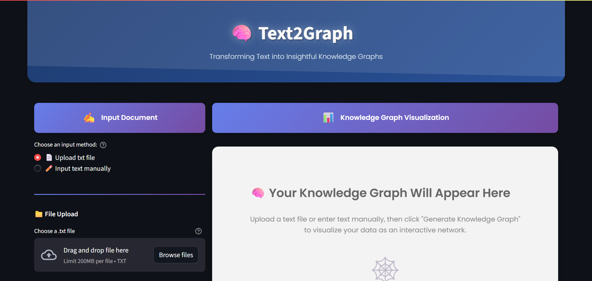
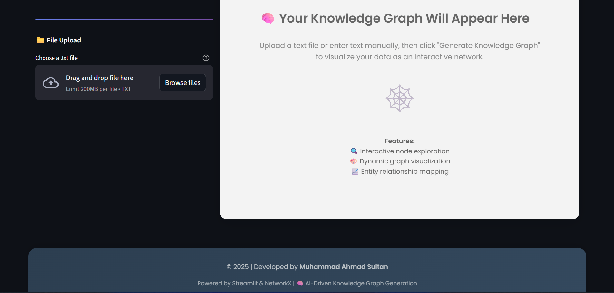
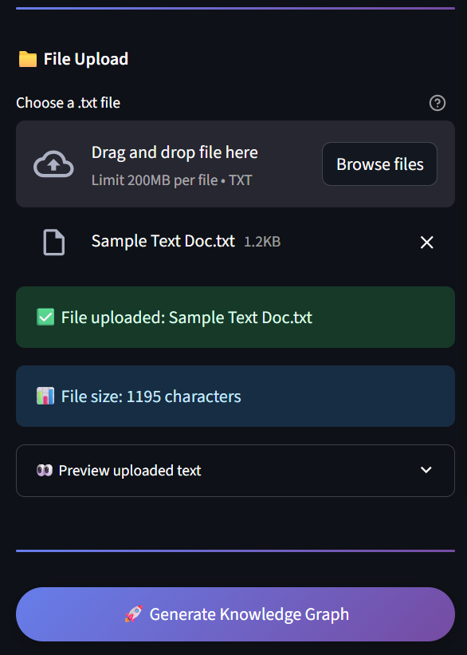
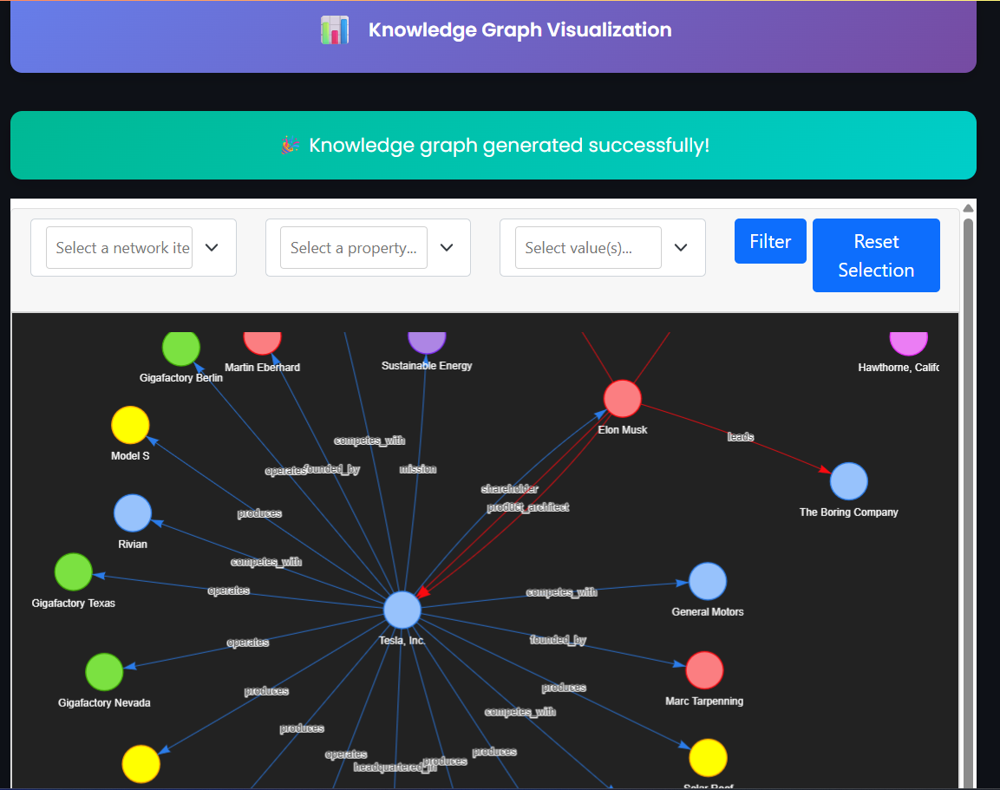

# Text2Graph: Transforming Text into Insightful Knowledge Graphs

[](https://www.python.org/downloads/)
[](https://streamlit.io/)
[](https://langchain.com/)
[](https://openai.com/)

**Text2Graph** is an intelligent web application that transforms unstructured text into interactive knowledge graphs using advanced AI and natural language processing techniques. Built with Streamlit and powered by LangChain and OpenAI's GPT-4, this application extracts entities, relationships, and semantic connections from text to create visually compelling and interactive knowledge graphs.

## 🌟 Features

- **🧠 AI-Powered Text Analysis**: Leverages OpenAI's GPT-4 through LangChain for intelligent entity and relationship extraction
- **📊 Interactive Visualizations**: Creates dynamic, interactive knowledge graphs using PyVis
- **🎨 Modern UI**: Beautiful, responsive interface with gradient backgrounds and intuitive design
- **⚡ Real-time Processing**: Instant graph generation from text input
- **📱 Responsive Design**: Works seamlessly across different screen sizes
- **🔧 Customizable**: Easy to extend and modify for specific use cases

## 🚀 Demo






## 📋 Prerequisites

- Python 3.8 or higher
- OpenAI API key
- Internet connection for API calls

## 🛠️ Installation

1. **Clone the repository**
   ```bash
   git clone <repository-url>
   cd Knowledge_Graph_App
   ```

2. **Create a virtual environment**
   ```bash
   python -m venv env
   source env/bin/activate  # On Windows: env\Scripts\activate
   ```

3. **Install required dependencies**
   ```bash
   pip install streamlit
   pip install langchain
   pip install langchain-openai
   pip install langchain-experimental
   pip install pyvis
   pip install python-dotenv
   ```

4. **Set up environment variables**
   Create a `.env` file in the root directory and add your OpenAI API key:
   ```
   OPENAI_API_KEY=your_openai_api_key_here
   ```

## 🎯 Usage

1. **Start the application**
   ```bash
   streamlit run app.py
   ```

2. **Open your browser**
   Navigate to `http://localhost:8501`

3. **Input your text**
   - Paste or type your text in the input area
   - Click "Generate Knowledge Graph"
   - View the interactive graph visualization

## 📁 Project Structure

```
Knowledge_Graph_App/
├── app.py                          # Main Streamlit application
├── generate_knowledge_graph.py     # Core graph generation logic
├── knowledge_graph.html           # Generated graph visualization
├── assets/                        # Sample documents and images
│   ├── Sample Text Doc.txt
│   ├── Text2Graph-1.png
│   ├── Text2Graph-2.png
│   ├── Text2Graph-3.png
│   └── Text2Graph-4.png
├── .env                           # Environment variables (not tracked)
├── .gitignore                     # Git ignore file
└── README.md                      # This file
```

## 🔧 Core Components

### `app.py`
The main Streamlit application that provides:
- User interface with modern styling
- Text input handling
- Graph visualization display
- Responsive layout design

### `generate_knowledge_graph.py`
Core functionality including:
- **`extract_graph_data(text)`**: Extracts entities and relationships from text
- **`visualize_graph(graph_documents)`**: Creates interactive PyVis visualizations
- **`generate_knowledge_graph(text)`**: Main function that orchestrates the entire process

## 🎨 Customization

### Styling
The application uses custom CSS for modern styling. You can modify the appearance by editing the CSS in `app.py`:
- Color schemes and gradients
- Typography and fonts
- Layout and spacing
- Component styling

### Graph Visualization
Customize graph appearance in `generate_knowledge_graph.py`:
- Node colors and sizes
- Edge styles and weights
- Physics simulation parameters
- Layout algorithms

## 📊 Example Use Cases

- **Research Analysis**: Extract key concepts and relationships from academic papers
- **Business Intelligence**: Analyze business documents and reports
- **Content Analysis**: Understand connections in articles and documents
- **Educational Tools**: Create visual learning aids from textbooks
- **Data Exploration**: Discover hidden patterns in textual data

## 🔍 Sample Input

The application works with various types of text. Here's an example using the included sample:

```text
Tesla, Inc., founded in 2003 by engineers Martin Eberhard and Marc Tarpenning, 
is an American electric vehicle and clean energy company headquartered in Palo Alto, 
California. Elon Musk joined the company shortly after its founding, investing $6.5 million 
and becoming its largest shareholder...
```

This generates a knowledge graph showing relationships between Tesla, its founders, products, locations, and related companies.

## 🤝 Contributing

Contributions are welcome! Please feel free to submit a Pull Request. For major changes, please open an issue first to discuss what you would like to change.

## 📄 License

This project is licensed under the MIT License - see the LICENSE file for details.

## 👨‍💻 Author

**Muhammad Ahmad Sultan**
- Email: m.ahmad.sultan82@gmail.com
- LinkedIn: https://www.linkedin.com/in/ahmadsultan03/
- GitHub: https://github.com/ahmadsultan03
- Contact: +92-306-1611301

## 🙏 Acknowledgments

- [LangChain](https://langchain.com/) for the graph transformation capabilities
- [OpenAI](https://openai.com/) for the powerful GPT-4 model
- [Streamlit](https://streamlit.io/) for the excellent web framework
- [PyVis](https://pyvis.readthedocs.io/) for interactive graph visualizations

## 🐛 Troubleshooting

### Common Issues

1. **API Key Error**
   - Ensure your OpenAI API key is correctly set in the `.env` file
   - Verify the API key has sufficient credits

2. **Import Errors**
   - Make sure all dependencies are installed: `pip install -r requirements.txt`
   - Check that you're using the correct Python version (3.8+)

3. **Graph Not Displaying**
   - Check browser console for JavaScript errors
   - Ensure the `knowledge_graph.html` file is being generated

### Support

If you encounter any issues or have questions, please:
1. Check the troubleshooting section above
2. Search existing issues in the repository
3. Create a new issue with detailed information about the problem

---

**⭐ If you found this project helpful, please give it a star!**
